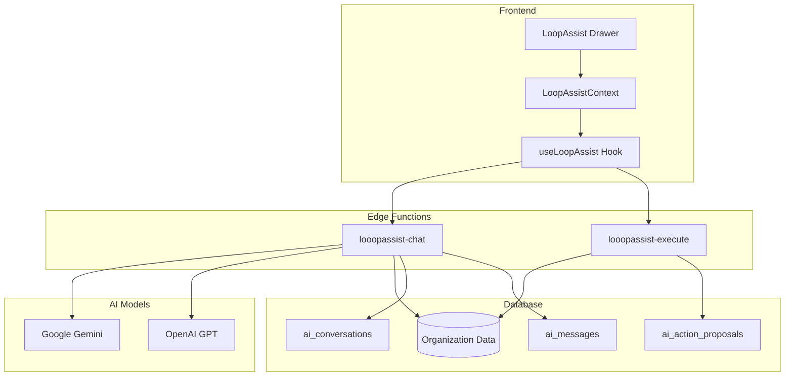
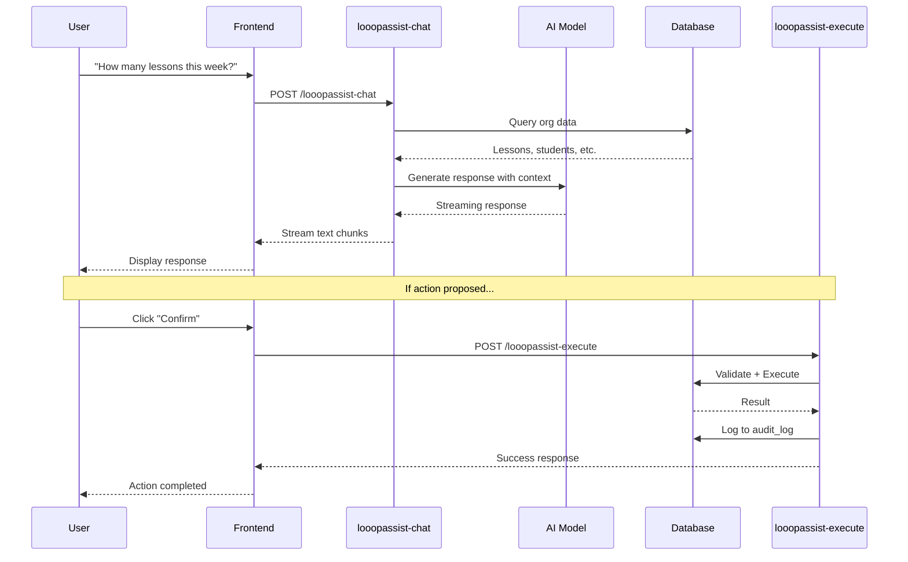
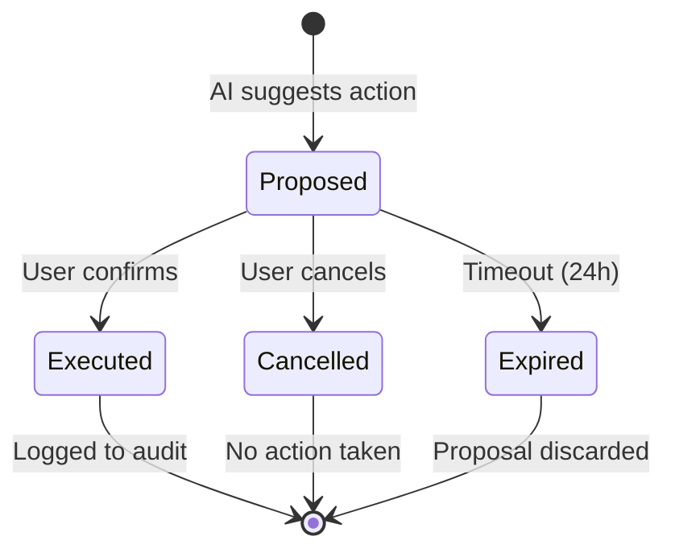

# AI Subsystem (LoopAssist)

> **Document Type**: AI Architecture Reference  
> **Last Updated**: 2026-01-20

---

## 1. Overview

LoopAssist is an AI-powered assistant integrated into LessonLoop that helps users with:
- **Information queries**: Answering questions about schedules, invoices, students
- **Data analysis**: Summarizing trends, identifying issues
- **Action proposals**: Suggesting and executing bulk operations

### 1.1 Key Principles

| Principle | Implementation |
|-----------|----------------|
| **Read-only by default** | AI can query but not modify without confirmation |
| **Confirmation required** | All write actions require explicit user approval |
| **Audit trail** | All AI actions are logged |
| **Context-aware** | AI understands current page and org context |
| **Multi-tenant safe** | AI only accesses data within user's org |

---

## 2. Architecture

### 2.1 System Components



### 2.2 Data Flow



---

## 3. Database Schema

### 3.1 Conversations

```sql
CREATE TABLE ai_conversations (
  id uuid PRIMARY KEY DEFAULT gen_random_uuid(),
  org_id uuid NOT NULL REFERENCES organisations(id),
  user_id uuid NOT NULL,
  title text NOT NULL DEFAULT 'New conversation',
  created_at timestamptz NOT NULL DEFAULT now(),
  updated_at timestamptz NOT NULL DEFAULT now()
);
```

### 3.2 Messages

```sql
CREATE TABLE ai_messages (
  id uuid PRIMARY KEY DEFAULT gen_random_uuid(),
  org_id uuid NOT NULL REFERENCES organisations(id),
  conversation_id uuid NOT NULL REFERENCES ai_conversations(id),
  user_id uuid NOT NULL,
  role text NOT NULL,  -- 'user' or 'assistant'
  content text NOT NULL,
  metadata jsonb DEFAULT '{}',
  created_at timestamptz NOT NULL DEFAULT now()
);
```

### 3.3 Action Proposals

```sql
CREATE TABLE ai_action_proposals (
  id uuid PRIMARY KEY DEFAULT gen_random_uuid(),
  org_id uuid NOT NULL REFERENCES organisations(id),
  user_id uuid NOT NULL,
  conversation_id uuid REFERENCES ai_conversations(id),
  proposal jsonb NOT NULL,
  status text NOT NULL DEFAULT 'proposed',  -- proposed/executed/cancelled
  result jsonb,
  executed_at timestamptz,
  created_at timestamptz NOT NULL DEFAULT now()
);
```

### 3.4 RLS Policies

All AI tables are protected by RLS:

```sql
-- Users can only see their own conversations
CREATE POLICY "Users can view own conversations"
ON ai_conversations FOR SELECT
USING (auth.uid() = user_id AND is_org_member(auth.uid(), org_id));

-- Users can only see their own messages
CREATE POLICY "Users can view messages in own conversations"
ON ai_messages FOR SELECT
USING (auth.uid() = user_id AND is_org_member(auth.uid(), org_id));
```

---

## 4. Edge Functions

### 4.1 looopassist-chat

**Purpose**: Handle AI chat requests with context-aware responses

**Endpoint**: `POST /functions/v1/looopassist-chat`

**Request**:
```json
{
  "message": "How many lessons are scheduled this week?",
  "conversationId": "uuid-optional",
  "pageContext": {
    "page": "/calendar",
    "studentCount": 25,
    "overdueInvoices": 3
  }
}
```

**Process**:
1. Authenticate user from JWT
2. Get or create conversation
3. Fetch org context (overdue invoices, upcoming lessons, etc.)
4. Build system prompt with context
5. Call AI model (streaming)
6. Save messages to database
7. Parse any action proposals from response
8. Stream response to client

**Response**: Streaming text with optional action proposals

### 4.2 looopassist-execute

**Purpose**: Execute confirmed AI action proposals

**Endpoint**: `POST /functions/v1/looopassist-execute`

**Request**:
```json
{
  "proposalId": "proposal-uuid",
  "action": "confirm"
}
```

**Process**:
1. Authenticate user from JWT
2. Verify user has permission (owner/admin)
3. Fetch proposal from database
4. Validate proposal is still pending
5. Execute action based on type
6. Update proposal status
7. Log to audit trail
8. Return result

**Response**:
```json
{
  "success": true,
  "message": "Created 15 invoices totaling £2,250.00",
  "result": {
    "invoicesCreated": 15,
    "totalAmount": 225000
  }
}
```

---

## 5. Supported Actions

### 5.1 Action Types

| Action | Parameters | Description | Role Required |
|--------|------------|-------------|---------------|
| `generate_billing_run` | start_date, end_date, mode | Create draft invoices | owner, admin |
| `send_invoice_reminders` | invoice_ids | Send payment reminders | owner, admin |
| `reschedule_lessons` | lesson_ids, shift | Move lessons | owner, admin |
| `draft_email` | recipient, subject, body | Create email draft | Any |
| `mark_attendance` | lesson_id, records | Record attendance | teacher+ |
| `update_student_status` | student_ids, status | Bulk status change | owner, admin |

### 5.2 Action Proposal Format

```json
{
  "action": "generate_billing_run",
  "params": {
    "startDate": "2026-01-01",
    "endDate": "2026-01-31",
    "mode": "monthly"
  },
  "description": "Generate invoices for January 2026",
  "affectedCount": 45,
  "preview": [
    { "guardianName": "John Parent", "amount": 14000 },
    { "guardianName": "Jane Parent", "amount": 10500 }
  ]
}
```

### 5.3 Action Execution Flow



---

## 6. Context Building

### 6.1 Page Context

The frontend provides current page context:

```typescript
const pageContext = {
  page: '/calendar',
  currentDate: '2026-01-20',
  selectedTeacher: 'uuid',
  viewMode: 'week'
};
```

### 6.2 Organization Context

The edge function fetches org context:

```typescript
const context = {
  orgName: org.name,
  orgType: org.org_type,
  timezone: org.timezone,
  currency: org.currency_code,
  
  // Current state
  activeStudents: await getActiveStudentCount(),
  upcomingLessons: await getUpcomingLessons(7),
  overdueInvoices: await getOverdueInvoices(),
  recentPayments: await getRecentPayments(7),
  
  // Today's schedule
  todaysLessons: await getTodaysLessons()
};
```

### 6.3 System Prompt

```typescript
const systemPrompt = `
You are LoopAssist, an AI assistant for ${context.orgName}, 
a ${context.orgType} music teaching organization.

Current context:
- ${context.activeStudents} active students
- ${context.upcomingLessons.length} lessons scheduled this week
- ${context.overdueInvoices.length} overdue invoices
- Today is ${format(new Date(), 'EEEE, d MMMM yyyy')} (${context.timezone})
- Currency: ${context.currency}

You can reference entities using [Type:ID] format, e.g., [Student:abc123].

When suggesting actions, format them as:
[ACTION:type:params_json]

Never execute actions directly - only propose them for user confirmation.
`;
```

---

## 7. Entity References

### 7.1 Format

AI responses can include entity references:

```
[Student:abc123] has 3 lessons this week.
[Invoice:def456] is 14 days overdue.
```

### 7.2 Supported Entity Types

| Type | Example | Linked To |
|------|---------|-----------|
| `Student` | `[Student:uuid]` | Student detail page |
| `Guardian` | `[Guardian:uuid]` | Guardian profile |
| `Lesson` | `[Lesson:uuid]` | Lesson detail panel |
| `Invoice` | `[Invoice:uuid]` | Invoice detail page |
| `Teacher` | `[Teacher:uuid]` | Teacher profile |

### 7.3 Frontend Rendering

```typescript
// EntityChip component
function EntityChip({ type, id }: { type: string; id: string }) {
  const { data } = useEntityDetails(type, id);
  
  return (
    <Link to={getEntityUrl(type, id)}>
      <Badge variant="outline">
        {getEntityIcon(type)}
        {data?.name || id}
      </Badge>
    </Link>
  );
}
```

---

## 8. Security

### 8.1 Access Control

| Operation | Role Required |
|-----------|---------------|
| Create conversation | Any org member |
| Send message | Any org member |
| View conversations | Own conversations only |
| Execute read actions | Any org member |
| Execute write actions | owner, admin |

### 8.2 Data Access

AI can only access:
- Data within user's current organization
- Data permitted by RLS policies
- Aggregated statistics, not raw exports

### 8.3 Rate Limiting

| Limit | Value |
|-------|-------|
| Messages per minute | 10 |
| Conversations per day | 50 |
| Action proposals per hour | 20 |

### 8.4 Audit Trail

All AI interactions are logged:

```sql
-- Conversation creation logged
INSERT INTO audit_log (action, entity_type, entity_id)
VALUES ('create', 'ai_conversations', conversation_id);

-- Action execution logged
INSERT INTO audit_log (action, entity_type, entity_id, before, after)
VALUES ('ai_action_execute', 'ai_action_proposals', proposal_id, 
        proposal_data, result_data);
```

---

## 9. AI Models

### 9.1 Available Models

LessonLoop uses Lovable AI, which provides access to:

| Model | Use Case | Context Window |
|-------|----------|----------------|
| `google/gemini-2.5-pro` | Complex reasoning | 1M tokens |
| `google/gemini-2.5-flash` | Fast responses | 1M tokens |
| `openai/gpt-5` | Advanced reasoning | 128K tokens |
| `openai/gpt-5-mini` | Cost-effective | 128K tokens |

### 9.2 Model Selection

```typescript
// Default model for chat
const model = 'google/gemini-2.5-flash';

// Complex analysis uses pro model
const analysisModel = 'google/gemini-2.5-pro';
```

### 9.3 No External API Keys Required

Lovable AI provides model access without requiring users to configure API keys.

---

## 10. Frontend Integration

### 10.1 LoopAssistContext

```typescript
interface LoopAssistContextType {
  isOpen: boolean;
  openDrawer: () => void;
  closeDrawer: () => void;
  currentConversationId: string | null;
  setCurrentConversationId: (id: string | null) => void;
}
```

### 10.2 useLoopAssist Hook

```typescript
function useLoopAssist() {
  return {
    // State
    conversations: AIConversation[];
    messages: AIMessage[];
    isStreaming: boolean;
    pendingProposals: AIActionProposal[];
    
    // Actions
    createConversation: () => Promise<string>;
    sendMessage: (content: string) => Promise<void>;
    handleProposal: (id: string, action: 'confirm' | 'cancel') => Promise<void>;
    deleteConversation: (id: string) => Promise<void>;
  };
}
```

### 10.3 UI Components

| Component | Purpose |
|-----------|---------|
| `LoopAssistDrawer` | Slide-out chat panel |
| `ActionCard` | Display action proposals |
| `EntityChip` | Clickable entity references |

---

## 11. Error Handling

### 11.1 Error Types

| Error | Handling |
|-------|----------|
| Rate limit | Display "Please wait" message |
| Auth error | Redirect to login |
| Model error | Retry with fallback model |
| Network error | Retry with exponential backoff |

### 11.2 Graceful Degradation

If AI services are unavailable:
- Chat shows "AI temporarily unavailable"
- Action proposals disabled
- Manual operations still work

---

## 12. Privacy Considerations

### 12.1 Data Sent to AI

| Data | Sent? | Purpose |
|------|-------|---------|
| User message | ✅ | Query processing |
| Org context (counts) | ✅ | Accurate responses |
| Sample records | ✅ | Specific answers |
| Full data exports | ❌ | Never sent |
| Passwords/tokens | ❌ | Never sent |

### 12.2 Data Retention

| Provider | Retention |
|----------|-----------|
| Lovable AI | Not retained after response |
| LessonLoop | Stored in ai_messages |

### 12.3 User Control

Users can:
- Delete conversations
- Disable AI features (org setting - future)
- Opt out of AI entirely (contact admin)

---

## 13. Future Enhancements

| Feature | Status | Description |
|---------|--------|-------------|
| Voice input | Planned | Speak to LoopAssist |
| Document analysis | Planned | Upload and analyze PDFs |
| Scheduled reports | Planned | Weekly AI-generated summaries |
| Natural language filters | Planned | "Show me lessons next week" |
| Multi-turn actions | Planned | Complex workflows with AI guidance |

---

→ Next: [FRONTEND_ARCHITECTURE.md](./FRONTEND_ARCHITECTURE.md)
