# Data Model

> **Document Type**: Database Schema Reference  
> **Last Updated**: 2026-01-20

---

## 1. Entity Relationship Diagram

```mermaid
erDiagram
    organisations ||--o{ org_memberships : "has members"
    organisations ||--o{ students : "contains"
    organisations ||--o{ guardians : "contains"
    organisations ||--o{ lessons : "schedules"
    organisations ||--o{ invoices : "generates"
    organisations ||--o{ locations : "has"
    organisations ||--o{ rate_cards : "defines"
    organisations ||--o{ message_templates : "owns"
    organisations ||--o{ closure_dates : "sets"
    organisations ||--o{ billing_runs : "performs"
    organisations ||--o{ ai_conversations : "has"
    organisations ||--o{ audit_log : "logs"
    
    profiles ||--o{ org_memberships : "belongs to"
    profiles ||--o{ user_roles : "has"
    
    students ||--o{ lesson_participants : "attends"
    students ||--o{ student_guardians : "linked to"
    students ||--o{ attendance_records : "has"
    students ||--o{ invoice_items : "billed for"
    students ||--o{ student_teacher_assignments : "assigned to"
    
    teacher_profiles ||--o{ student_teacher_assignments : "teaches"
    
    guardians ||--o{ student_guardians : "linked to"
    guardians ||--o{ invoices : "pays"
    guardians ||--o{ message_requests : "creates"
    
    lessons ||--o{ lesson_participants : "includes"
    lessons ||--o{ attendance_records : "records"
    lessons ||--o{ invoice_items : "generates"
    lessons }o--|| recurrence_rules : "follows"
    lessons }o--|| locations : "at"
    lessons }o--|| rooms : "in"
    
    locations ||--o{ rooms : "contains"
    locations ||--o{ closure_dates : "applies to"
    
    invoices ||--o{ invoice_items : "contains"
    invoices ||--o{ payments : "receives"
    
    ai_conversations ||--o{ ai_messages : "contains"
    ai_conversations ||--o{ ai_action_proposals : "generates"
    
    teacher_profiles }o--|| profiles : "extends"
    availability_blocks }o--|| profiles : "for teacher"
    availability_templates }o--|| profiles : "for user"
    time_off_blocks }o--|| profiles : "for teacher"
```

---

## 2. Table Definitions

### 2.1 Core Organization Tables

#### `organisations`
Primary organization entity. All other data is scoped to an organization.

| Column | Type | Nullable | Default | Description |
|--------|------|----------|---------|-------------|
| `id` | uuid | No | `gen_random_uuid()` | Primary key |
| `name` | text | No | - | Organization name |
| `org_type` | org_type | No | `'solo_teacher'` | Type of organization |
| `country_code` | text | No | `'GB'` | ISO country code |
| `currency_code` | text | No | `'GBP'` | ISO currency code |
| `timezone` | text | No | `'Europe/London'` | IANA timezone |
| `vat_enabled` | boolean | No | `false` | Whether VAT applies |
| `vat_rate` | numeric | No | `0` | VAT percentage |
| `vat_registration_number` | text | Yes | - | VAT reg number |
| `billing_approach` | billing_approach | No | `'monthly'` | Billing frequency |
| `default_lesson_length_mins` | integer | No | `60` | Default lesson duration |
| `block_scheduling_on_closures` | boolean | No | `true` | Prevent scheduling on closures |
| `created_by` | uuid | No | - | Creator user ID |
| `created_at` | timestamptz | No | `now()` | Creation timestamp |

#### `profiles`
User profile data. Created automatically on signup via trigger.

| Column | Type | Nullable | Default | Description |
|--------|------|----------|---------|-------------|
| `id` | uuid | No | - | User ID (matches auth.users) |
| `email` | text | Yes | - | Email address |
| `full_name` | text | Yes | - | Display name |
| `phone` | text | Yes | - | Phone number |
| `current_org_id` | uuid | Yes | - | Currently selected org |
| `has_completed_onboarding` | boolean | No | `false` | Onboarding status |
| `created_at` | timestamptz | No | `now()` | Creation timestamp |
| `updated_at` | timestamptz | No | `now()` | Last update |

#### `org_memberships`
Links users to organizations with roles.

| Column | Type | Nullable | Default | Description |
|--------|------|----------|---------|-------------|
| `id` | uuid | No | `gen_random_uuid()` | Primary key |
| `org_id` | uuid | No | - | Organization FK |
| `user_id` | uuid | No | - | User FK |
| `role` | app_role | No | - | Member role |
| `status` | membership_status | No | `'active'` | Membership status |
| `created_at` | timestamptz | No | `now()` | Creation timestamp |

#### `user_roles`
Global role assignments (separate from org memberships).

| Column | Type | Nullable | Default | Description |
|--------|------|----------|---------|-------------|
| `id` | uuid | No | `gen_random_uuid()` | Primary key |
| `user_id` | uuid | No | - | User FK |
| `role` | app_role | No | - | Assigned role |
| `created_at` | timestamptz | No | `now()` | Creation timestamp |

#### `invites`
Pending organization invitations.

| Column | Type | Nullable | Default | Description |
|--------|------|----------|---------|-------------|
| `id` | uuid | No | `gen_random_uuid()` | Primary key |
| `org_id` | uuid | No | - | Organization FK |
| `email` | text | No | - | Invitee email |
| `role` | app_role | No | - | Invited role |
| `token` | uuid | No | `gen_random_uuid()` | Invite token |
| `expires_at` | timestamptz | No | `now() + 7 days` | Expiration |
| `accepted_at` | timestamptz | Yes | - | Acceptance timestamp |
| `created_at` | timestamptz | No | `now()` | Creation timestamp |

---

### 2.2 Student & Guardian Tables

#### `students`
Student records with soft-delete support.

| Column | Type | Nullable | Default | Description |
|--------|------|----------|---------|-------------|
| `id` | uuid | No | `gen_random_uuid()` | Primary key |
| `org_id` | uuid | No | - | Organization FK |
| `first_name` | text | No | - | First name |
| `last_name` | text | No | - | Last name |
| `email` | text | Yes | - | Email address |
| `phone` | text | Yes | - | Phone number |
| `dob` | date | Yes | - | Date of birth |
| `notes` | text | Yes | - | Private notes |
| `status` | student_status | No | `'active'` | Active/Inactive |
| `deleted_at` | timestamptz | Yes | - | Soft-delete timestamp |
| `created_at` | timestamptz | No | `now()` | Creation timestamp |
| `updated_at` | timestamptz | No | `now()` | Last update |

#### `guardians`
Parent/guardian records with soft-delete support.

| Column | Type | Nullable | Default | Description |
|--------|------|----------|---------|-------------|
| `id` | uuid | No | `gen_random_uuid()` | Primary key |
| `org_id` | uuid | No | - | Organization FK |
| `user_id` | uuid | Yes | - | Linked user (for portal) |
| `full_name` | text | No | - | Full name |
| `email` | text | Yes | - | Email address |
| `phone` | text | Yes | - | Phone number |
| `deleted_at` | timestamptz | Yes | - | Soft-delete timestamp |
| `created_at` | timestamptz | No | `now()` | Creation timestamp |
| `updated_at` | timestamptz | No | `now()` | Last update |

#### `student_guardians`
Junction table linking students to guardians.

| Column | Type | Nullable | Default | Description |
|--------|------|----------|---------|-------------|
| `id` | uuid | No | `gen_random_uuid()` | Primary key |
| `org_id` | uuid | No | - | Organization FK |
| `student_id` | uuid | No | - | Student FK |
| `guardian_id` | uuid | No | - | Guardian FK |
| `relationship` | relationship_type | No | `'guardian'` | Relationship type |
| `is_primary_payer` | boolean | No | `false` | Primary billing contact |
| `created_at` | timestamptz | No | `now()` | Creation timestamp |

---

### 2.3 Scheduling Tables

#### `lessons`
Individual lesson instances.

| Column | Type | Nullable | Default | Description |
|--------|------|----------|---------|-------------|
| `id` | uuid | No | `gen_random_uuid()` | Primary key |
| `org_id` | uuid | No | - | Organization FK |
| `title` | text | No | - | Lesson title |
| `teacher_user_id` | uuid | No | - | Assigned teacher |
| `start_at` | timestamptz | No | - | Start datetime |
| `end_at` | timestamptz | No | - | End datetime |
| `lesson_type` | lesson_type | No | `'private'` | Private/Group |
| `status` | lesson_status | No | `'scheduled'` | Status |
| `location_id` | uuid | Yes | - | Location FK |
| `room_id` | uuid | Yes | - | Room FK |
| `recurrence_id` | uuid | Yes | - | Recurrence rule FK |
| `notes_shared` | text | Yes | - | Notes visible to parents |
| `notes_private` | text | Yes | - | Private teacher notes |
| `online_meeting_url` | text | Yes | - | Video call link |
| `created_by` | uuid | No | - | Creator user ID |
| `created_at` | timestamptz | No | `now()` | Creation timestamp |
| `updated_at` | timestamptz | No | `now()` | Last update |

#### `lesson_participants`
Junction table linking lessons to students.

| Column | Type | Nullable | Default | Description |
|--------|------|----------|---------|-------------|
| `id` | uuid | No | `gen_random_uuid()` | Primary key |
| `org_id` | uuid | No | - | Organization FK |
| `lesson_id` | uuid | No | - | Lesson FK |
| `student_id` | uuid | No | - | Student FK |
| `created_at` | timestamptz | No | `now()` | Creation timestamp |

#### `recurrence_rules`
Defines repeating lesson patterns.

| Column | Type | Nullable | Default | Description |
|--------|------|----------|---------|-------------|
| `id` | uuid | No | `gen_random_uuid()` | Primary key |
| `org_id` | uuid | No | - | Organization FK |
| `pattern_type` | recurrence_pattern | No | `'weekly'` | Pattern type |
| `interval_weeks` | integer | No | `1` | Week interval |
| `days_of_week` | integer[] | No | `'{}'` | Days (0=Sun, 6=Sat) |
| `start_date` | date | No | - | Start date |
| `end_date` | date | Yes | - | End date (null = forever) |
| `timezone` | text | No | `'Europe/London'` | Timezone |
| `created_at` | timestamptz | No | `now()` | Creation timestamp |

#### `attendance_records`
Lesson attendance tracking.

| Column | Type | Nullable | Default | Description |
|--------|------|----------|---------|-------------|
| `id` | uuid | No | `gen_random_uuid()` | Primary key |
| `org_id` | uuid | No | - | Organization FK |
| `lesson_id` | uuid | No | - | Lesson FK |
| `student_id` | uuid | No | - | Student FK |
| `attendance_status` | attendance_status | No | `'present'` | Status |
| `cancellation_reason` | text | Yes | - | Reason if cancelled |
| `recorded_by` | uuid | No | - | User who recorded |
| `recorded_at` | timestamptz | No | `now()` | Recording timestamp |

---

### 2.4 Location Tables

#### `locations`
Physical or virtual teaching locations.

| Column | Type | Nullable | Default | Description |
|--------|------|----------|---------|-------------|
| `id` | uuid | No | `gen_random_uuid()` | Primary key |
| `org_id` | uuid | No | - | Organization FK |
| `name` | text | No | - | Location name |
| `location_type` | location_type | No | `'studio'` | Type |
| `address_line_1` | text | Yes | - | Address line 1 |
| `address_line_2` | text | Yes | - | Address line 2 |
| `city` | text | Yes | - | City |
| `postcode` | text | Yes | - | Postcode |
| `country_code` | text | No | `'GB'` | Country |
| `notes` | text | Yes | - | Notes |
| `is_primary` | boolean | No | `false` | Primary location |
| `created_at` | timestamptz | No | `now()` | Creation timestamp |
| `updated_at` | timestamptz | No | `now()` | Last update |

#### `rooms`
Rooms within locations.

| Column | Type | Nullable | Default | Description |
|--------|------|----------|---------|-------------|
| `id` | uuid | No | `gen_random_uuid()` | Primary key |
| `org_id` | uuid | No | - | Organization FK |
| `location_id` | uuid | No | - | Location FK |
| `name` | text | No | - | Room name |
| `capacity` | integer | Yes | - | Max students |
| `created_at` | timestamptz | No | `now()` | Creation timestamp |
| `updated_at` | timestamptz | No | `now()` | Last update |

#### `closure_dates`
Dates when no lessons should be scheduled.

| Column | Type | Nullable | Default | Description |
|--------|------|----------|---------|-------------|
| `id` | uuid | No | `gen_random_uuid()` | Primary key |
| `org_id` | uuid | No | - | Organization FK |
| `date` | date | No | - | Closure date |
| `reason` | text | No | - | Reason (e.g., "Bank Holiday") |
| `applies_to_all_locations` | boolean | No | `true` | Org-wide or location-specific |
| `location_id` | uuid | Yes | - | Location FK (if specific) |
| `created_by` | uuid | No | - | Creator user ID |
| `created_at` | timestamptz | No | `now()` | Creation timestamp |

---

### 2.5 Availability Tables

#### `availability_blocks`
Weekly availability slots for teachers.

| Column | Type | Nullable | Default | Description |
|--------|------|----------|---------|-------------|
| `id` | uuid | No | `gen_random_uuid()` | Primary key |
| `org_id` | uuid | No | - | Organization FK |
| `teacher_user_id` | uuid | No | - | Teacher user ID |
| `day_of_week` | day_of_week | No | - | Day of week |
| `start_time_local` | time | No | - | Start time |
| `end_time_local` | time | No | - | End time |
| `created_at` | timestamptz | No | `now()` | Creation timestamp |

#### `availability_templates`
Reusable availability patterns.

| Column | Type | Nullable | Default | Description |
|--------|------|----------|---------|-------------|
| `id` | uuid | No | `gen_random_uuid()` | Primary key |
| `org_id` | uuid | No | - | Organization FK |
| `user_id` | uuid | No | - | User ID |
| `day_of_week` | day_of_week | No | - | Day of week |
| `start_time` | time | No | - | Start time |
| `end_time` | time | No | - | End time |
| `is_available` | boolean | No | `true` | Available or blocked |
| `created_at` | timestamptz | No | `now()` | Creation timestamp |

#### `time_off_blocks`
Specific time-off periods for teachers.

| Column | Type | Nullable | Default | Description |
|--------|------|----------|---------|-------------|
| `id` | uuid | No | `gen_random_uuid()` | Primary key |
| `org_id` | uuid | No | - | Organization FK |
| `teacher_user_id` | uuid | No | - | Teacher user ID |
| `start_at` | timestamptz | No | - | Start datetime |
| `end_at` | timestamptz | No | - | End datetime |
| `reason` | text | Yes | - | Reason |
| `created_at` | timestamptz | No | `now()` | Creation timestamp |

---

### 2.6 Billing Tables

#### `invoices`
Invoice headers.

| Column | Type | Nullable | Default | Description |
|--------|------|----------|---------|-------------|
| `id` | uuid | No | `gen_random_uuid()` | Primary key |
| `org_id` | uuid | No | - | Organization FK |
| `invoice_number` | text | No | - | Auto-generated number |
| `payer_guardian_id` | uuid | Yes | - | Guardian payer FK |
| `payer_student_id` | uuid | Yes | - | Student payer FK |
| `status` | invoice_status | No | `'draft'` | Status |
| `issue_date` | date | No | `CURRENT_DATE` | Issue date |
| `due_date` | date | No | - | Payment due date |
| `subtotal_minor` | integer | No | `0` | Subtotal in pence |
| `tax_minor` | integer | No | `0` | VAT in pence |
| `total_minor` | integer | No | `0` | Total in pence |
| `vat_rate` | numeric | No | `0` | VAT percentage |
| `currency_code` | text | No | `'GBP'` | Currency |
| `notes` | text | Yes | - | Invoice notes |
| `created_at` | timestamptz | No | `now()` | Creation timestamp |
| `updated_at` | timestamptz | No | `now()` | Last update |

**Invoice Number Format**: `LL-YYYY-XXXXX` (e.g., `LL-2026-00042`)

#### `invoice_items`
Line items on invoices.

| Column | Type | Nullable | Default | Description |
|--------|------|----------|---------|-------------|
| `id` | uuid | No | `gen_random_uuid()` | Primary key |
| `org_id` | uuid | No | - | Organization FK |
| `invoice_id` | uuid | No | - | Invoice FK |
| `description` | text | No | - | Line item description |
| `quantity` | integer | No | `1` | Quantity |
| `unit_price_minor` | integer | No | - | Unit price in pence |
| `amount_minor` | integer | No | - | Total in pence |
| `student_id` | uuid | Yes | - | Related student FK |
| `linked_lesson_id` | uuid | Yes | - | Related lesson FK |
| `created_at` | timestamptz | No | `now()` | Creation timestamp |

#### `payments`
Payment records against invoices.

| Column | Type | Nullable | Default | Description |
|--------|------|----------|---------|-------------|
| `id` | uuid | No | `gen_random_uuid()` | Primary key |
| `org_id` | uuid | No | - | Organization FK |
| `invoice_id` | uuid | No | - | Invoice FK |
| `amount_minor` | integer | No | - | Amount in pence |
| `currency_code` | text | No | `'GBP'` | Currency |
| `method` | payment_method | No | `'other'` | Payment method |
| `provider` | payment_provider | No | `'manual'` | Payment provider |
| `provider_reference` | text | Yes | - | External reference |
| `paid_at` | timestamptz | No | `now()` | Payment datetime |
| `created_at` | timestamptz | No | `now()` | Creation timestamp |
| `updated_at` | timestamptz | Yes | `now()` | Last update |

#### `rate_cards`
Pricing templates.

| Column | Type | Nullable | Default | Description |
|--------|------|----------|---------|-------------|
| `id` | uuid | No | `gen_random_uuid()` | Primary key |
| `org_id` | uuid | No | - | Organization FK |
| `name` | text | No | - | Rate card name |
| `rate_amount` | numeric | No | - | Price in major units |
| `currency_code` | text | No | `'GBP'` | Currency |
| `duration_mins` | integer | No | `60` | Lesson duration |
| `is_default` | boolean | No | `false` | Default rate card |
| `created_at` | timestamptz | No | `now()` | Creation timestamp |
| `updated_at` | timestamptz | No | `now()` | Last update |

#### `billing_runs`
Batch billing run records.

| Column | Type | Nullable | Default | Description |
|--------|------|----------|---------|-------------|
| `id` | uuid | No | `gen_random_uuid()` | Primary key |
| `org_id` | uuid | No | - | Organization FK |
| `run_type` | billing_run_type | No | `'monthly'` | Run type |
| `start_date` | date | No | - | Period start |
| `end_date` | date | No | - | Period end |
| `status` | billing_run_status | No | `'pending'` | Status |
| `summary` | jsonb | Yes | `'{}'` | Run statistics |
| `created_by` | uuid | No | - | Creator user ID |
| `created_at` | timestamptz | No | `now()` | Creation timestamp |

---

### 2.7 Messaging Tables

#### `message_log`
Sent message history.

| Column | Type | Nullable | Default | Description |
|--------|------|----------|---------|-------------|
| `id` | uuid | No | `gen_random_uuid()` | Primary key |
| `org_id` | uuid | No | - | Organization FK |
| `message_type` | text | No | - | Type (invoice, reminder, etc.) |
| `channel` | text | No | `'email'` | Delivery channel |
| `recipient_type` | text | Yes | - | Recipient type |
| `recipient_id` | uuid | Yes | - | Recipient FK |
| `recipient_name` | text | Yes | - | Recipient name |
| `recipient_email` | text | No | - | Recipient email |
| `subject` | text | No | - | Message subject |
| `body` | text | No | - | Message body |
| `status` | text | No | `'pending'` | Delivery status |
| `sent_at` | timestamptz | Yes | - | Sent timestamp |
| `error_message` | text | Yes | - | Error if failed |
| `sender_user_id` | uuid | Yes | - | Sender user ID |
| `related_id` | uuid | Yes | - | Related entity ID |
| `created_at` | timestamptz | No | `now()` | Creation timestamp |

#### `message_templates`
Reusable message templates.

| Column | Type | Nullable | Default | Description |
|--------|------|----------|---------|-------------|
| `id` | uuid | No | `gen_random_uuid()` | Primary key |
| `org_id` | uuid | No | - | Organization FK |
| `name` | text | No | - | Template name |
| `channel` | text | No | `'email'` | Channel |
| `subject` | text | No | - | Subject template |
| `body` | text | No | - | Body template |
| `created_at` | timestamptz | No | `now()` | Creation timestamp |
| `updated_at` | timestamptz | No | `now()` | Last update |

#### `message_requests`
Parent portal inquiries.

| Column | Type | Nullable | Default | Description |
|--------|------|----------|---------|-------------|
| `id` | uuid | No | `gen_random_uuid()` | Primary key |
| `org_id` | uuid | No | - | Organization FK |
| `guardian_id` | uuid | No | - | Guardian FK |
| `request_type` | text | No | - | Request type |
| `subject` | text | No | - | Subject |
| `message` | text | No | - | Message body |
| `student_id` | uuid | Yes | - | Related student FK |
| `lesson_id` | uuid | Yes | - | Related lesson FK |
| `status` | text | No | `'pending'` | Status |
| `admin_response` | text | Yes | - | Admin reply |
| `responded_by` | uuid | Yes | - | Responder user ID |
| `responded_at` | timestamptz | Yes | - | Response timestamp |
| `created_at` | timestamptz | No | `now()` | Creation timestamp |
| `updated_at` | timestamptz | No | `now()` | Last update |

---

### 2.8 AI Tables

#### `ai_conversations`
LoopAssist chat sessions.

| Column | Type | Nullable | Default | Description |
|--------|------|----------|---------|-------------|
| `id` | uuid | No | `gen_random_uuid()` | Primary key |
| `org_id` | uuid | No | - | Organization FK |
| `user_id` | uuid | No | - | User FK |
| `title` | text | No | `'New conversation'` | Conversation title |
| `created_at` | timestamptz | No | `now()` | Creation timestamp |
| `updated_at` | timestamptz | No | `now()` | Last update |

#### `ai_messages`
Individual chat messages.

| Column | Type | Nullable | Default | Description |
|--------|------|----------|---------|-------------|
| `id` | uuid | No | `gen_random_uuid()` | Primary key |
| `org_id` | uuid | No | - | Organization FK |
| `conversation_id` | uuid | No | - | Conversation FK |
| `user_id` | uuid | No | - | User FK |
| `role` | text | No | - | 'user' or 'assistant' |
| `content` | text | No | - | Message content |
| `metadata` | jsonb | Yes | `'{}'` | Additional data |
| `created_at` | timestamptz | No | `now()` | Creation timestamp |

#### `ai_action_proposals`
Pending AI action proposals.

| Column | Type | Nullable | Default | Description |
|--------|------|----------|---------|-------------|
| `id` | uuid | No | `gen_random_uuid()` | Primary key |
| `org_id` | uuid | No | - | Organization FK |
| `user_id` | uuid | No | - | User FK |
| `conversation_id` | uuid | Yes | - | Conversation FK |
| `proposal` | jsonb | No | - | Action details |
| `status` | text | No | `'proposed'` | proposed/executed/cancelled |
| `result` | jsonb | Yes | - | Execution result |
| `executed_at` | timestamptz | Yes | - | Execution timestamp |
| `created_at` | timestamptz | No | `now()` | Creation timestamp |

---

### 2.9 Teacher Table

#### `teacher_profiles`
Extended profile data for teachers.

| Column | Type | Nullable | Default | Description |
|--------|------|----------|---------|-------------|
| `id` | uuid | No | `gen_random_uuid()` | Primary key |
| `org_id` | uuid | No | - | Organization FK |
| `user_id` | uuid | No | - | User FK |
| `display_name` | text | Yes | - | Public display name |
| `bio` | text | Yes | - | Biography |
| `instruments` | text[] | No | `'{}'` | Instruments taught |
| `teaching_address` | text | Yes | - | Teaching location |
| `default_lesson_length_mins` | integer | No | `60` | Default duration |
| `employment_type` | employment_type | No | `'contractor'` | Employment type |
| `pay_rate_type` | pay_rate_type | Yes | `'per_lesson'` | Pay calculation |
| `pay_rate_value` | numeric | Yes | `0` | Pay rate |
| `payroll_notes` | text | Yes | - | Payroll notes |
| `created_at` | timestamptz | No | `now()` | Creation timestamp |
| `updated_at` | timestamptz | No | `now()` | Last update |

---

### 2.10 Student-Teacher Assignments

#### `student_teacher_assignments`
Maps students to their assigned teachers (for academies/agencies with scoped access).

| Column | Type | Nullable | Default | Description |
|--------|------|----------|---------|-------------|
| `id` | uuid | No | `gen_random_uuid()` | Primary key |
| `org_id` | uuid | No | - | Organization FK |
| `student_id` | uuid | No | - | Student FK |
| `teacher_user_id` | uuid | No | - | Teacher user FK |
| `is_primary` | boolean | No | `false` | Primary teacher flag |
| `created_at` | timestamptz | No | `now()` | Creation timestamp |

**Unique constraint**: `(org_id, student_id, teacher_user_id)`

---

### 2.11 Audit Table

#### `audit_log`
Immutable audit trail for all changes.

| Column | Type | Nullable | Default | Description |
|--------|------|----------|---------|-------------|
| `id` | uuid | No | `gen_random_uuid()` | Primary key |
| `org_id` | uuid | No | - | Organization FK |
| `actor_user_id` | uuid | Yes | - | User who made change |
| `action` | text | No | - | create/update/delete |
| `entity_type` | text | No | - | Table name |
| `entity_id` | uuid | Yes | - | Affected row ID |
| `before` | jsonb | Yes | - | State before change |
| `after` | jsonb | Yes | - | State after change |
| `created_at` | timestamptz | No | `now()` | Timestamp |

---

## 3. Enum Types

| Enum | Values |
|------|--------|
| `app_role` | `owner`, `admin`, `teacher`, `finance`, `parent` |
| `org_type` | `solo_teacher`, `studio`, `academy`, `agency` |
| `membership_status` | `active`, `invited`, `disabled` |
| `student_status` | `active`, `inactive` |
| `lesson_type` | `private`, `group` |
| `lesson_status` | `scheduled`, `completed`, `cancelled` |
| `attendance_status` | `present`, `absent`, `late`, `cancelled_by_teacher`, `cancelled_by_student` |
| `location_type` | `school`, `studio`, `home`, `online` |
| `day_of_week` | `monday`, `tuesday`, `wednesday`, `thursday`, `friday`, `saturday`, `sunday` |
| `recurrence_pattern` | `weekly` |
| `invoice_status` | `draft`, `sent`, `paid`, `overdue`, `void` |
| `billing_approach` | `monthly`, `termly`, `custom` |
| `billing_run_type` | `monthly`, `term`, `custom` |
| `billing_run_status` | `pending`, `completed`, `failed` |
| `payment_method` | `card`, `bank_transfer`, `cash`, `other` |
| `payment_provider` | `stripe`, `manual` |
| `relationship_type` | `mother`, `father`, `guardian`, `other` |
| `employment_type` | `employee`, `contractor` |
| `pay_rate_type` | `per_lesson`, `hourly`, `percentage` |

---

## 4. Database Functions

| Function | Purpose | Returns |
|----------|---------|---------|
| `is_org_member(user_id, org_id)` | Check if user is org member | boolean |
| `is_org_admin(user_id, org_id)` | Check if user is owner/admin | boolean |
| `has_org_role(user_id, org_id, role)` | Check specific role | boolean |
| `get_org_role(user_id, org_id)` | Get user's role in org | app_role |
| `is_parent_of_student(user_id, student_id)` | Check parent-student link | boolean |
| `is_invoice_payer(user_id, invoice_id)` | Check invoice payer | boolean |
| `get_student_ids_for_parent(user_id)` | Get linked student IDs | uuid[] |
| `get_guardian_ids_for_user(user_id)` | Get guardian records for user | uuid[] |
| `generate_invoice_number(org_id)` | Generate next invoice number | text |
| `anonymise_student(student_id)` | GDPR anonymization | void |
| `anonymise_guardian(guardian_id)` | GDPR anonymization | void |
| `log_audit_event()` | Trigger function for audit | trigger |
| `handle_new_user()` | Create profile on signup | trigger |
| `handle_new_organisation()` | Create owner membership | trigger |
| `update_updated_at_column()` | Auto-update timestamps | trigger |

---

## 5. Performance Indexes

All tables have composite indexes on frequently queried columns:

| Table | Index Columns |
|-------|---------------|
| `lessons` | `(org_id, start_at)`, `(org_id, teacher_user_id)`, `(org_id, status)` |
| `invoices` | `(org_id, status)`, `(org_id, due_date)`, `(org_id, payer_guardian_id)` |
| `students` | `(org_id, status)`, `(org_id, deleted_at)` |
| `guardians` | `(org_id, deleted_at)`, `(org_id, user_id)` |
| `audit_log` | `(org_id, created_at)`, `(org_id, entity_type)` |
| `attendance_records` | `(org_id, lesson_id)`, `(org_id, student_id)` |
| `message_log` | `(org_id, created_at)`, `(org_id, status)` |

---

→ Next: [SECURITY_MODEL.md](./SECURITY_MODEL.md)
