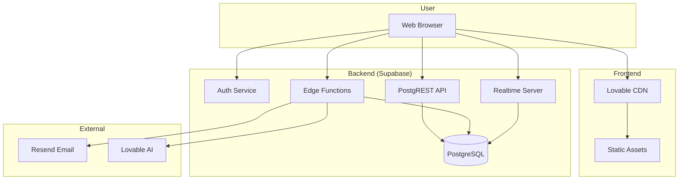

# Deployment

> **Document Type**: Infrastructure Reference  
> **Last Updated**: 2026-01-20

---

## 1. Infrastructure Overview



---

## 2. Hosting Architecture

### 2.1 Frontend Hosting

| Component | Provider | Description |
|-----------|----------|-------------|
| Static files | Lovable CDN | Vite build output |
| SSL/TLS | Automatic | Let's Encrypt |
| Domain | Lovable | *.lovable.app |
| Custom domain | Supported | CNAME configuration |

### 2.2 Backend Hosting

| Component | Provider | Description |
|-----------|----------|-------------|
| Database | Supabase | PostgreSQL 15 |
| Auth | Supabase Auth | Email + JWT |
| API | PostgREST | Auto-generated REST |
| Edge Functions | Deno Deploy | Serverless |
| Realtime | Supabase | WebSocket connections |

---

## 3. Environment Configuration

### 3.1 Frontend Environment

File: `.env` (auto-generated, do not edit)

```env
VITE_SUPABASE_URL=https://ximxgnkpcswbvfrkkmjq.supabase.co
VITE_SUPABASE_PUBLISHABLE_KEY=eyJhbGci...
VITE_SUPABASE_PROJECT_ID=ximxgnkpcswbvfrkkmjq
```

### 3.2 Edge Function Secrets

| Secret | Purpose | Required By |
|--------|---------|-------------|
| `SUPABASE_URL` | Database connection | All edge functions |
| `SUPABASE_ANON_KEY` | Client auth validation | `invite-accept`, `looopassist-chat` |
| `SUPABASE_SERVICE_ROLE_KEY` | Service role for admin operations | `invite-get`, `invite-accept`, `gdpr-export`, `gdpr-delete`, `csv-import-execute` |
| `SUPABASE_DB_URL` | Direct DB access | Some functions |
| `LOVABLE_API_KEY` | AI model access | `looopassist-chat`, `csv-import-mapping` |
| `RESEND_API_KEY` | Email sending via Resend | `send-message`, `send-invoice-email`, `send-invite-email` |

### 3.3 Managing Secrets

Secrets are managed via Lovable Cloud interface:

1. Navigate to project settings
2. Select "Secrets" tab
3. Add/update secrets
4. Secrets available in edge functions via `Deno.env.get()`

---

## 4. Build Process

### 4.1 Frontend Build

```bash
# Development
npm run dev

# Production build
npm run build

# Preview production build
npm run preview
```

### 4.2 Build Output

```
dist/
├── assets/
│   ├── index-[hash].js      # Main bundle
│   ├── index-[hash].css     # Styles
│   └── [route]-[hash].js    # Code-split chunks
├── index.html
└── favicon.ico
```

### 4.3 Build Configuration

```typescript
// vite.config.ts
export default defineConfig({
  plugins: [react()],
  resolve: {
    alias: {
      '@': path.resolve(__dirname, './src'),
    },
  },
  build: {
    rollupOptions: {
      output: {
        manualChunks: {
          vendor: ['react', 'react-dom', 'react-router-dom'],
          supabase: ['@supabase/supabase-js'],
          query: ['@tanstack/react-query'],
        },
      },
    },
  },
});
```

---

## 5. Edge Function Deployment

### 5.1 Function Structure

```
supabase/
├── functions/
│   ├── looopassist-chat/
│   │   └── index.ts
│   ├── looopassist-execute/
│   │   └── index.ts
│   ├── csv-import-mapping/
│   │   └── index.ts
│   ├── csv-import-execute/
│   │   └── index.ts
│   ├── gdpr-export/
│   │   └── index.ts
│   ├── gdpr-delete/
│   │   └── index.ts
│   ├── send-message/
│   │   └── index.ts
│   ├── send-invoice-email/
│   │   └── index.ts
│   └── send-invite-email/
│       └── index.ts
└── config.toml
```

### 5.2 Automatic Deployment

Edge functions are automatically deployed when:
- Code changes are pushed
- Lovable builds the project

No manual deployment commands needed.

### 5.3 Function Configuration

```toml
# supabase/config.toml
[functions.looopassist-chat]
verify_jwt = true

[functions.gdpr-export]
verify_jwt = true
```

---

## 6. Database Migrations

### 6.1 Migration Files

```
supabase/
└── migrations/
    ├── 20260115000000_initial_schema.sql
    ├── 20260116000000_add_ai_tables.sql
    ├── 20260117000000_add_rls_policies.sql
    ├── 20260118000000_add_functions.sql
    ├── 20260119000000_add_triggers.sql
    └── 20260120000000_add_indexes.sql
```

### 6.2 Migration Process

Migrations are applied via Lovable's migration tool:

1. Write SQL migration
2. Submit for review
3. User approves
4. Migration executes
5. Types regenerated

### 6.3 Migration Best Practices

```sql
-- Always use IF NOT EXISTS
CREATE TABLE IF NOT EXISTS public.new_table (...);

-- Add columns safely
ALTER TABLE public.existing_table 
ADD COLUMN IF NOT EXISTS new_column text;

-- Create indexes concurrently (when possible)
CREATE INDEX CONCURRENTLY IF NOT EXISTS idx_name ON table_name (column);

-- Use transactions for multi-step changes
BEGIN;
  ALTER TABLE ...;
  CREATE INDEX ...;
COMMIT;
```

---

## 7. Monitoring

### 7.1 Supabase Dashboard

Available metrics:
- Database connections
- Query execution time
- API requests
- Edge function invocations
- Auth events

### 7.2 Application Monitoring

```typescript
// Error tracking (future)
import * as Sentry from '@sentry/react';

Sentry.init({
  dsn: 'https://...',
  environment: import.meta.env.MODE,
  tracesSampleRate: 0.1,
});
```

### 7.3 Health Checks

| Check | Endpoint | Expected |
|-------|----------|----------|
| Frontend | `/` | 200 OK |
| API | `/rest/v1/` | 200 OK |
| Auth | `/auth/v1/health` | 200 OK |
| Database | Connection test | Success |

---

## 8. Scaling Considerations

### 8.1 Database

| Tier | Connections | Compute | Storage |
|------|-------------|---------|---------|
| Free | 60 | Shared | 500MB |
| Pro | 200 | Dedicated | 8GB |
| Team | 400 | Dedicated | 16GB+ |

### 8.2 Edge Functions

| Metric | Limit |
|--------|-------|
| Invocations/month | Varies by plan |
| Execution time | 60s |
| Memory | 512MB |
| Payload size | 6MB |

### 8.3 Optimization for Scale

```sql
-- Connection pooling
-- Configured in Supabase dashboard

-- Partition large tables (future)
CREATE TABLE audit_log_2026 PARTITION OF audit_log
FOR VALUES FROM ('2026-01-01') TO ('2027-01-01');

-- Archive old data (future)
CREATE TABLE audit_log_archive AS
SELECT * FROM audit_log WHERE created_at < '2025-01-01';
```

---

## 9. Backup & Recovery

### 9.1 Automatic Backups

| Plan | Frequency | Retention |
|------|-----------|-----------|
| Free | Daily | 7 days |
| Pro | Daily | 14 days |
| Team | Daily + PITR | 30 days |

### 9.2 Manual Backup

```bash
# Export via pg_dump (requires direct access)
pg_dump -h db.ximxgnkpcswbvfrkkmjq.supabase.co \
  -U postgres \
  -d postgres \
  -f backup.sql
```

### 9.3 Recovery Process

1. Contact Supabase support (Pro+)
2. Specify recovery point
3. Restore to new or existing project

---

## 10. Security Hardening

### 10.1 Production Checklist

- [ ] **Disable auto-confirm email signups** - In Supabase dashboard: Authentication → Settings → Email → Disable "Confirm email"
- [ ] **Enable leaked password protection** - In Supabase dashboard: Authentication → Settings → Password → Enable "Leaked password protection"  
- [ ] **Configure ALLOWED_ORIGINS secret** - Set to your production domain(s), comma-separated
- [ ] **Set FRONTEND_URL secret** - Required for correct portal links in emails
- [ ] **Configure RESEND_API_KEY** - Required for actual email delivery
- [ ] Review all RLS policies
- [ ] Enable database connection SSL
- [ ] Set up monitoring alerts
- [ ] Rate limiting is now enabled for LoopAssist (30 req/5min) and email sending (20 req/5min)

### 10.2 Environment Separation

| Environment | Purpose | Data |
|-------------|---------|------|
| Development | Local testing | Seed data |
| Staging | Pre-production | Anonymized prod data |
| Production | Live | Real data |

### 10.3 Access Control

| Role | Dashboard | API | Database |
|------|-----------|-----|----------|
| Developer | ✅ | ✅ | Read-only |
| Admin | ✅ | ✅ | ✅ |
| Viewer | ✅ | ❌ | ❌ |

---

## 11. URLs

### 11.1 Current URLs

| Purpose | URL |
|---------|-----|
| Preview | https://id-preview--c541d756-90e7-442a-ba85-0c723aeabc14.lovable.app |
| Production | (Not yet published) |
| API | https://ximxgnkpcswbvfrkkmjq.supabase.co |

### 11.2 Custom Domain Setup

1. Add CNAME record: `app.yourdomain.com → [lovable-cname]`
2. Configure in Lovable project settings
3. SSL certificate auto-provisioned

---

## 12. Disaster Recovery

### 12.1 RPO/RTO Targets

| Metric | Target | Current |
|--------|--------|---------|
| RPO (data loss) | < 1 hour | Daily backup |
| RTO (recovery time) | < 4 hours | Manual process |

### 12.2 Incident Response

1. **Detect**: Monitoring alerts
2. **Assess**: Determine impact
3. **Communicate**: Notify stakeholders
4. **Mitigate**: Apply fixes
5. **Recover**: Restore services
6. **Review**: Post-incident analysis

### 12.3 Runbook

| Scenario | Action |
|----------|--------|
| Database unavailable | Contact Supabase support |
| Edge functions failing | Check logs, redeploy |
| High latency | Check query performance |
| Security breach | Rotate keys, review logs |

---

## 13. Compliance

### 13.1 Data Residency

| Component | Location |
|-----------|----------|
| Database | EU (Supabase default) |
| Edge Functions | Edge (closest region) |
| CDN | Global |

### 13.2 Certifications

Supabase provides:
- SOC 2 Type II
- GDPR compliance
- ISO 27001 (in progress)

---

## 14. Support Contacts

| Issue | Contact |
|-------|---------|
| Platform issues | Lovable support |
| Database issues | Supabase support |
| Billing | Platform provider |
| Security incidents | Security team |

---

← Back to [README.md](./README.md)
