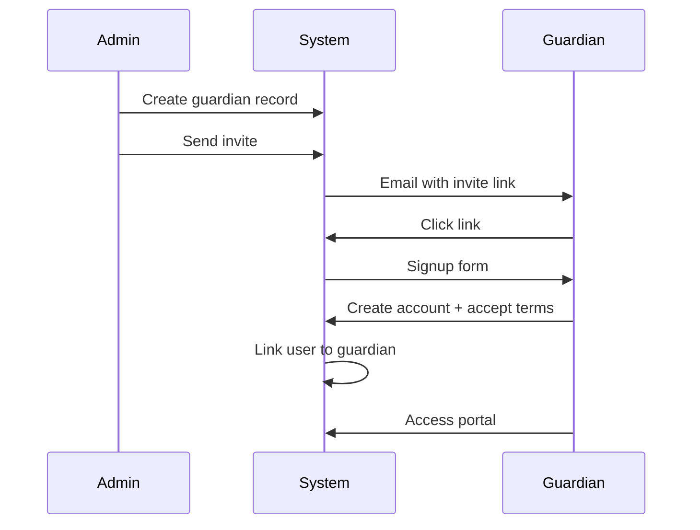
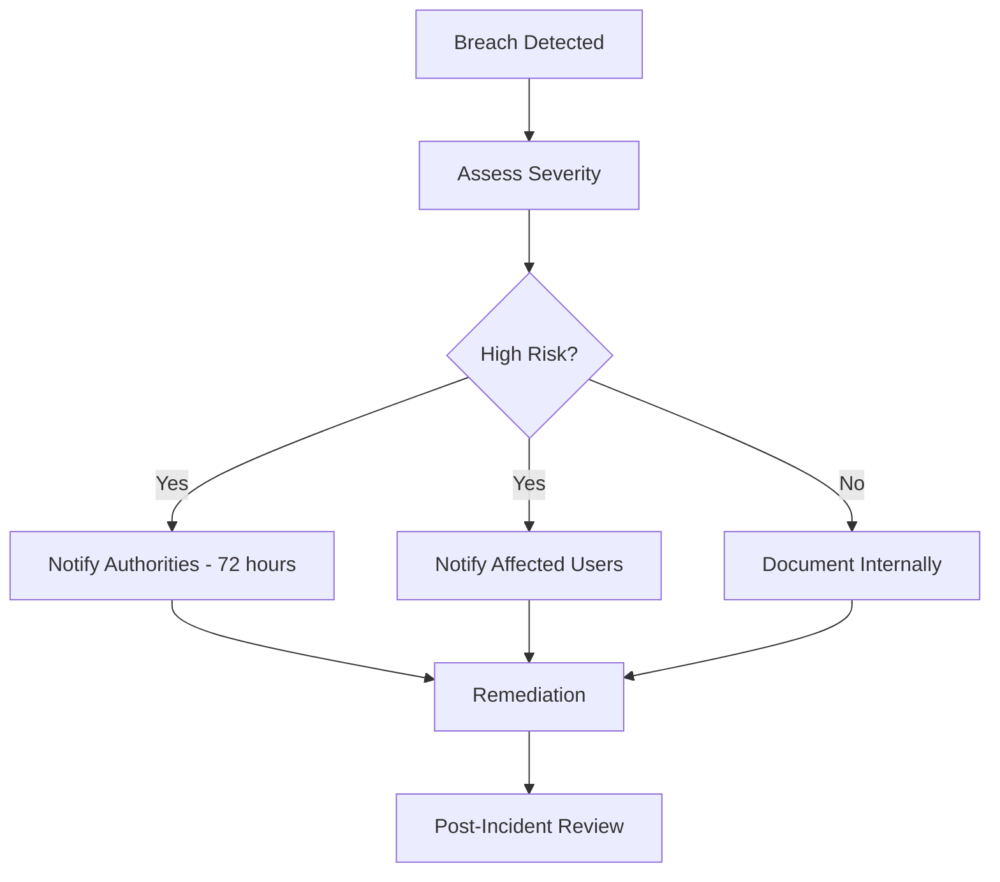

# GDPR Compliance

> **Document Type**: Data Protection & Privacy  
> **Last Updated**: 2026-01-20

---

## 1. Overview

LessonLoop processes personal data of students, guardians (parents), and staff within music teaching organizations. This document outlines GDPR compliance measures implemented in the platform.

### 1.1 Data Controller vs Processor

| Role | Entity |
|------|--------|
| **Data Controller** | Each organization using LessonLoop |
| **Data Processor** | LessonLoop platform |

Organizations are responsible for:
- Lawful basis for processing
- Privacy notices to data subjects
- Responding to data subject requests
- Data retention decisions

LessonLoop provides tools to facilitate these responsibilities.

---

## 2. Personal Data Inventory

### 2.1 Categories of Data Subjects

| Category | Examples |
|----------|----------|
| Students | Children and adults receiving lessons |
| Guardians | Parents, legal guardians |
| Staff | Teachers, administrators, finance staff |

### 2.2 Personal Data Collected

#### Student Data

| Field | Purpose | Lawful Basis |
|-------|---------|--------------|
| `first_name`, `last_name` | Identification | Contract |
| `email` | Communication | Legitimate interest |
| `phone` | Communication | Legitimate interest |
| `dob` | Age-appropriate services | Contract |
| `notes` | Lesson planning | Legitimate interest |

#### Guardian Data

| Field | Purpose | Lawful Basis |
|-------|---------|--------------|
| `full_name` | Identification | Contract |
| `email` | Invoicing, communication | Contract |
| `phone` | Communication | Legitimate interest |
| `user_id` | Portal access | Consent |

#### Staff Data

| Field | Purpose | Lawful Basis |
|-------|---------|--------------|
| `full_name` | Identification | Contract |
| `email` | Account access | Contract |
| `phone` | Communication | Legitimate interest |
| `pay_rate_value` | Payroll | Contract |
| `instruments` | Assignment | Contract |

### 2.3 Special Category Data

| Type | Collected? | Notes |
|------|------------|-------|
| Health data | ❌ No | Not collected by default |
| Biometric data | ❌ No | Not collected |
| Religious beliefs | ❌ No | Not collected |
| Ethnic origin | ❌ No | Not collected |

⚠️ **Note**: The `notes` field could contain special category data if entered by users. Organizations should have policies about what can be stored in notes.

---

## 3. Data Subject Rights

### 3.1 Rights Implementation Matrix

| Right | Article | Implemented | How |
|-------|---------|-------------|-----|
| Right of Access | Art. 15 | ✅ | GDPR Export feature |
| Right to Rectification | Art. 16 | ✅ | Edit via UI |
| Right to Erasure | Art. 17 | ✅ | Soft-delete + Anonymization |
| Right to Restriction | Art. 18 | ✅ | Status = 'inactive' |
| Right to Portability | Art. 20 | ✅ | CSV export |
| Right to Object | Art. 21 | ✅ | Contact organization |

### 3.2 Right of Access (Art. 15)

**Feature**: GDPR Data Export

**Location**: Settings > Privacy > Export Data

**Process**:
1. Admin navigates to Privacy settings
2. Clicks "Export All Data"
3. System generates CSV files for:
   - Students
   - Guardians
   - Lessons
   - Invoices
   - Payments
4. Files download to admin's browser
5. Admin provides to data subject

**API**:
```typescript
// POST /functions/v1/gdpr-export
const response = await supabase.functions.invoke('gdpr-export');
// Returns: { files: { students: "...", guardians: "...", ... } }
```

**Audit Trail**: Export events are logged to `audit_log`.

### 3.3 Right to Erasure (Art. 17)

**Features**: Soft-Delete and Anonymization

**Location**: Settings > Privacy > Data Deletion

#### Soft-Delete

Marks record as deleted but retains data:

```sql
UPDATE students SET
  deleted_at = now(),
  status = 'inactive'
WHERE id = student_id;
```

**Effect**:
- Record hidden from normal queries
- Data retained for legal compliance
- Can be restored if needed
- Visible only to admins

#### Anonymization

Irreversibly removes personal data:

```sql
-- anonymise_student function
UPDATE students SET
  first_name = 'Deleted',
  last_name = 'User',
  email = NULL,
  phone = NULL,
  dob = NULL,
  notes = NULL,
  deleted_at = now(),
  status = 'inactive'
WHERE id = student_id;
```

**Effect**:
- Personal data permanently removed
- Statistical record retained
- Invoice history preserved
- Cannot be reversed

### 3.4 Right to Rectification (Art. 16)

Users can update their data via:
- Admin UI (admins editing any record)
- Portal UI (parents editing own profile)
- Contacting organization

### 3.5 Right to Portability (Art. 20)

**Format**: CSV (comma-separated values)

**Encoding**: UTF-8

**Structure**: Each entity type in separate file with headers

Example student export:
```csv
id,first_name,last_name,email,phone,dob,status,created_at
uuid1,John,Doe,john@example.com,07123456789,2010-03-15,active,2025-01-15T10:00:00Z
uuid2,Jane,Smith,jane@example.com,,2012-08-22,active,2025-02-20T14:30:00Z
```

---

## 4. Data Retention

### 4.1 Retention Policy

| Data Type | Active | Soft-Deleted | Anonymized | Rationale |
|-----------|--------|--------------|------------|-----------|
| Students | Indefinite | 7 years | Indefinite | Legal compliance |
| Guardians | Indefinite | 7 years | Indefinite | Legal compliance |
| Lessons | Indefinite | N/A | N/A | Business records |
| Invoices | Indefinite | N/A | N/A | Financial records (6+ years UK) |
| Payments | Indefinite | N/A | N/A | Financial records |
| Audit logs | Indefinite | N/A | N/A | Compliance |
| Messages | 3 years | N/A | N/A | Communication records |

### 4.2 Financial Records

UK HMRC requires retention of financial records for 6 years. LessonLoop:
- Never deletes invoice or payment records
- Anonymization preserves financial data with anonymized names
- Audit trail maintained indefinitely

### 4.3 Deletion Candidates

The system identifies candidates for deletion:

```typescript
// Inactive students (no lessons in 6+ months)
const { data: students } = await supabase
  .from('students')
  .select('*')
  .eq('status', 'inactive')
  .is('deleted_at', null);

// Guardians with no active linked students
const { data: guardians } = await supabase
  .from('guardians')
  .select(`
    *,
    student_guardians(student_id)
  `)
  .is('deleted_at', null);
```

---

## 5. Consent Management

### 5.1 Types of Consent

| Activity | Consent Type | Mechanism |
|----------|--------------|-----------|
| Account creation | Implied | Signup action |
| Portal access | Explicit | Invite acceptance |
| Email communications | Implied | Account creation |
| Marketing | Not implemented | N/A |

### 5.2 Guardian Portal Access

Guardians are explicitly invited to access the portal:

1. Admin creates guardian record
2. Admin sends invite email
3. Guardian clicks link and creates account
4. Guardian accepts terms during signup
5. Link established between user and guardian record



### 5.3 Consent Withdrawal

Users can:
- Request account deletion via organization
- Unlink from students (admin action)
- Stop using portal (implicit withdrawal)

---

## 6. Data Processing Records

### 6.1 Processing Activities

| Activity | Purpose | Categories | Recipients | Retention |
|----------|---------|------------|------------|-----------|
| Student management | Service delivery | Name, contact, DOB | Org staff | Active + 7 years |
| Lesson scheduling | Service delivery | Schedule data | Org staff, parents | Indefinite |
| Invoicing | Contract fulfillment | Financial data | Org staff, payers | 7+ years |
| Email notifications | Communication | Contact info | Email provider (Resend) | 3 years |
| Audit logging | Compliance | All changes | Org admins | Indefinite |

### 6.2 Third-Party Processors

| Processor | Purpose | Data Shared | DPA Status |
|-----------|---------|-------------|------------|
| Supabase | Database hosting | All data | ✅ DPA in place |
| Resend | Email delivery | Email addresses, names | ✅ DPA in place |
| Lovable AI | AI features | Query context | ✅ DPA in place |

### 6.3 Data Transfers

| Destination | Mechanism | Safeguard |
|-------------|-----------|-----------|
| Supabase (EU/US) | Cloud hosting | SCCs |
| Resend (US) | Email delivery | SCCs |

---

## 7. Security Measures

### 7.1 Technical Measures

| Measure | Implementation |
|---------|----------------|
| Encryption in transit | TLS 1.3 |
| Encryption at rest | AES-256 |
| Access control | RLS policies |
| Authentication | JWT + session management |
| Audit trail | Immutable logs |

### 7.2 Organizational Measures

| Measure | Responsibility |
|---------|----------------|
| Staff training | Organization (controller) |
| Access reviews | Organization (controller) |
| Incident response | Shared |
| Privacy policy | Organization (controller) |

---

## 8. Breach Notification

### 8.1 Detection

Potential breach indicators:
- Unusual login patterns (Supabase Auth logs)
- Unexpected data access (Audit logs)
- API errors suggesting attacks

### 8.2 Response Process



### 8.3 Contact Information

Organizations should maintain:
- DPO contact (if applicable)
- ICO registration number
- Incident response procedures

---

## 9. Privacy by Design

### 9.1 Data Minimization

| Principle | Implementation |
|-----------|----------------|
| Collect only necessary | Optional fields for DOB, phone |
| Purpose limitation | Each field has defined purpose |
| Storage limitation | Retention policies |

### 9.2 Default Privacy

| Feature | Default |
|---------|---------|
| Student visibility | Org members only |
| Invoice visibility | Payer only |
| Audit log access | Admins only |
| Deleted records | Hidden from normal users |

### 9.3 Pseudonymization

Anonymization replaces identifiable data:
- `first_name` → "Deleted"
- `last_name` → "User"
- `email` → NULL
- `phone` → NULL
- `dob` → NULL

---

## 10. User Interface

### 10.1 Privacy Settings Location

**Path**: Settings > Privacy

**Access**: Owner and Admin roles only

### 10.2 Available Actions

| Action | Button | Confirmation |
|--------|--------|--------------|
| Export all data | "Export All Data" | None |
| Soft-delete student | "Delete" | Alert dialog |
| Anonymize student | "Anonymise" | Alert dialog |
| Soft-delete guardian | "Delete" | Alert dialog |
| Anonymize guardian | "Anonymise" | Alert dialog |

### 10.3 Deletion Candidates View

Shows:
- Inactive students
- Guardians without active linked students
- Last activity date
- Quick action buttons

---

## 11. API Reference

### 11.1 Export Endpoint

```typescript
// POST /functions/v1/gdpr-export
// Headers: Authorization: Bearer <jwt>

// Response:
{
  "organisation": "Academy Name",
  "exportedAt": "2026-01-20T10:00:00Z",
  "files": {
    "students": "CSV content...",
    "guardians": "CSV content...",
    "lessons": "CSV content...",
    "invoices": "CSV content...",
    "payments": "CSV content..."
  },
  "counts": {
    "students": 45,
    "guardians": 38,
    "lessons": 520,
    "invoices": 156,
    "payments": 142
  }
}
```

### 11.2 Delete Endpoint

```typescript
// POST /functions/v1/gdpr-delete
// Headers: Authorization: Bearer <jwt>
// Body:
{
  "action": "soft_delete" | "anonymise",
  "entityType": "student" | "guardian",
  "entityId": "uuid"
}

// Response:
{
  "success": true,
  "message": "Student record anonymised successfully"
}
```

---

## 12. Compliance Checklist

### For Organizations (Controllers)

- [ ] Privacy policy published
- [ ] Lawful basis documented
- [ ] Staff trained on data protection
- [ ] Data subject request process defined
- [ ] Breach notification process defined
- [ ] Retention periods configured
- [ ] Regular access reviews
- [ ] DPO appointed (if required)
- [ ] ICO registered (if required)

### Platform Features Available

- [x] Data export functionality
- [x] Soft-delete capability
- [x] Anonymization capability
- [x] Audit logging
- [x] Access control (RLS)
- [x] Encryption (transit + rest)
- [x] Deletion candidates identification

---

## 13. Contact

For data protection queries regarding the LessonLoop platform:
- Review platform documentation
- Contact platform support

For queries regarding specific organization's data practices:
- Contact the organization directly
- Organizations should provide their own privacy contact

---

→ Next: [AI_SUBSYSTEM.md](./AI_SUBSYSTEM.md)
