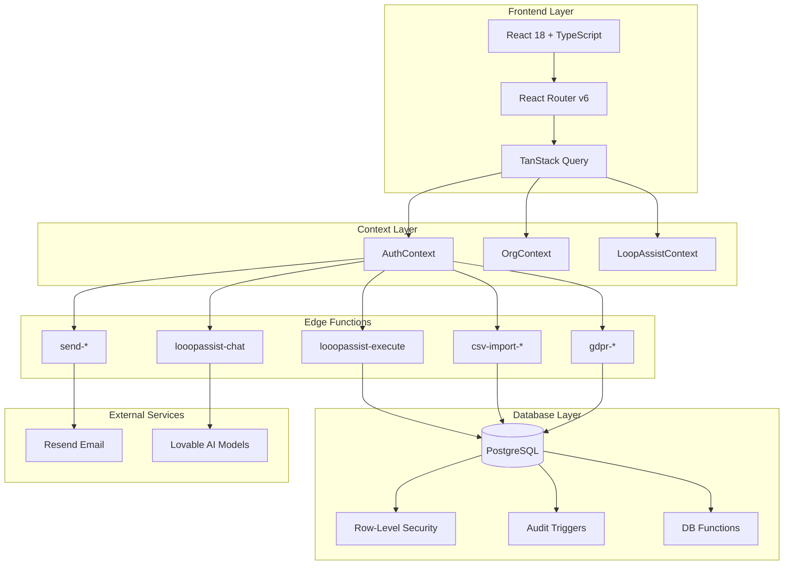

# LessonLoop System Audit Documentation

> **Version**: 1.0.0  
> **Last Updated**: 2026-01-20  
> **Classification**: Internal / Auditor Use

---

## Overview

LessonLoop is a UK-centric music lesson scheduling, invoicing, and portal management platform designed for solo teachers, studios, academies, and agencies. This documentation suite provides complete technical visibility into the system architecture, security model, data flows, and compliance measures.

---

## Document Index

| Document | Purpose | Audience |
|----------|---------|----------|
| [SYSTEM_OVERVIEW.md](./SYSTEM_OVERVIEW.md) | High-level architecture and technology stack | All auditors |
| [DATA_MODEL.md](./DATA_MODEL.md) | Complete database schema and relationships | Database auditors |
| [SECURITY_MODEL.md](./SECURITY_MODEL.md) | Authentication, authorization, and RLS policies | Security auditors |
| [API_REFERENCE.md](./API_REFERENCE.md) | Edge functions and API endpoints | API auditors |
| [AUDIT_LOGGING.md](./AUDIT_LOGGING.md) | Audit trail implementation | Compliance auditors |
| [GDPR_COMPLIANCE.md](./GDPR_COMPLIANCE.md) | Data protection and privacy measures | Privacy auditors |
| [AI_SUBSYSTEM.md](./AI_SUBSYSTEM.md) | LoopAssist AI copilot architecture | AI/ML auditors |
| [FRONTEND_ARCHITECTURE.md](./FRONTEND_ARCHITECTURE.md) | UI structure and navigation | Frontend auditors |
| [PERFORMANCE.md](./PERFORMANCE.md) | Optimization and indexing strategy | Performance auditors |
| [DEPLOYMENT.md](./DEPLOYMENT.md) | Infrastructure and environment configuration | DevOps auditors |

---

## Quick Facts

| Metric | Value |
|--------|-------|
| **Database Tables** | 26 |
| **RLS Policies** | 90+ |
| **Database Indexes** | 30+ |
| **Edge Functions** | 8 |
| **Frontend Routes** | 20+ |
| **User Roles** | 5 (owner, admin, teacher, finance, parent) |
| **Primary Currency** | GBP |
| **Primary Timezone** | Europe/London |
| **Date Format** | DD/MM/YYYY |

---

## System Diagram

---

## Key Contacts

| Role | Responsibility |
|------|----------------|
| Platform Owner | Overall system governance |
| Security Lead | RLS policies and access control |
| Data Protection Officer | GDPR compliance |
| DevOps Lead | Infrastructure and deployment |

---

## Revision History

| Version | Date | Author | Changes |
|---------|------|--------|---------|
| 1.0.0 | 2026-01-20 | System | Initial documentation |

---

## Navigation

→ Start with [SYSTEM_OVERVIEW.md](./SYSTEM_OVERVIEW.md) for executive summary  
→ Continue to [SECURITY_MODEL.md](./SECURITY_MODEL.md) for access control details  
→ Review [AUDIT_LOGGING.md](./AUDIT_LOGGING.md) for compliance trail
