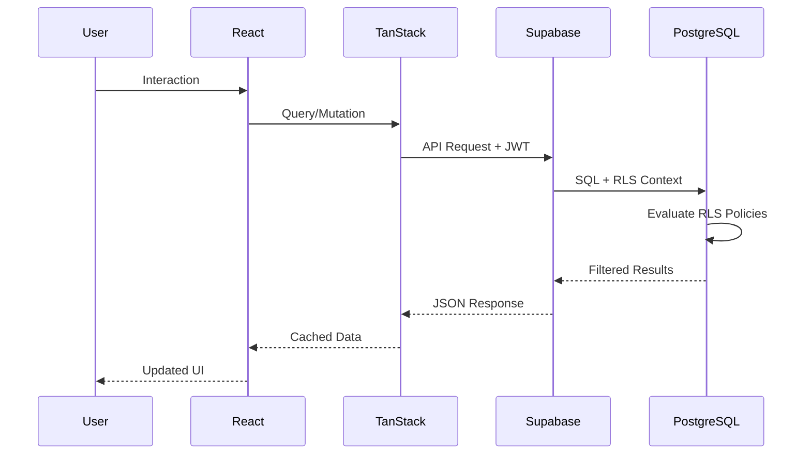
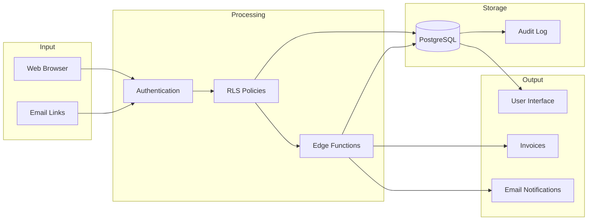

# System Overview

> **Document Type**: Executive Summary  
> **Last Updated**: 2026-01-20

---

## 1. Platform Purpose

LessonLoop is a comprehensive music lesson management platform designed specifically for the UK market. It serves:

- **Solo Teachers**: Independent music instructors managing their own students
- **Studios**: Small teaching spaces with multiple rooms
- **Academies**: Larger institutions with multiple teachers and locations
- **Agencies**: Organizations that connect teachers with students

### Core Capabilities

1. **Scheduling**: Calendar-first approach with conflict detection, recurrence rules, and closure date management
2. **Billing**: UK-centric invoicing with GBP currency, optional VAT, termly/monthly billing runs
3. **Parent Portal**: Guardian access to view schedules, invoices, and communicate with teachers
4. **AI Copilot (LoopAssist)**: Context-aware assistant for queries and action proposals
5. **Multi-Tenancy**: Complete data isolation between organizations

---

## 2. Technology Stack

### Frontend
| Technology | Version | Purpose |
|------------|---------|---------|
| React | 18.3.1 | UI framework |
| TypeScript | 5.x | Type safety |
| Vite | 5.x | Build tooling |
| TanStack Query | 5.83.0 | Server state management |
| React Router | 6.30.1 | Client-side routing |
| Tailwind CSS | 3.x | Styling |
| shadcn/ui | Latest | Component library |
| Framer Motion | - | Animations |

### Backend
| Technology | Purpose |
|------------|---------|
| Supabase | Backend-as-a-Service |
| PostgreSQL | Primary database |
| Deno | Edge function runtime |
| Row-Level Security | Data access control |

### External Services
| Service | Purpose |
|---------|---------|
| Resend | Transactional email delivery |
| Lovable AI | AI model access (Gemini, GPT) |

---

## 3. Architecture Patterns

### Multi-Tenancy Model

All data is scoped by `org_id`:

```
┌─────────────────────────────────────────────────────────────┐
│                      LessonLoop Platform                     │
├─────────────────────────────────────────────────────────────┤
│  ┌──────────────┐  ┌──────────────┐  ┌──────────────┐       │
│  │   Org A      │  │   Org B      │  │   Org C      │       │
│  │  (Academy)   │  │  (Solo)      │  │  (Agency)    │       │
│  ├──────────────┤  ├──────────────┤  ├──────────────┤       │
│  │ - Students   │  │ - Students   │  │ - Students   │       │
│  │ - Teachers   │  │ - Lessons    │  │ - Teachers   │       │
│  │ - Lessons    │  │ - Invoices   │  │ - Invoices   │       │
│  │ - Invoices   │  └──────────────┘  │ - Locations  │       │
│  │ - Locations  │                     └──────────────┘       │
│  └──────────────┘                                            │
│                                                              │
│  RLS enforces: WHERE org_id = current_user_org_id            │
└─────────────────────────────────────────────────────────────┘
```

### Request Flow



---

## 4. User Roles

| Role | Description | Typical User |
|------|-------------|--------------|
| `owner` | Full org control, billing, deletion | Org creator |
| `admin` | Manage all data except org deletion | Office manager |
| `teacher` | View schedule, manage own lessons | Instructor |
| `finance` | View/manage invoices and payments | Bookkeeper |
| `parent` | View linked students, pay invoices | Parent/Guardian |

### Role Hierarchy

```
owner
  └── admin
        ├── teacher
        ├── finance
        └── parent (portal-only)
```

---

## 5. UK-Centric Defaults

| Setting | Default Value |
|---------|---------------|
| Currency | GBP (£) |
| Timezone | Europe/London |
| Date Format | DD/MM/YYYY |
| VAT | Optional, 0-20% |
| Term Structure | UK academic terms |
| Bank Holidays | Configurable closure dates |

---

## 6. Module Summary

### Core Modules

| Module | Tables | Edge Functions | Primary Features |
|--------|--------|----------------|------------------|
| **Organizations** | `organisations`, `org_memberships`, `invites` | `send-invite-email` | Multi-org, roles, invites |
| **Students** | `students`, `guardians`, `student_guardians` | `csv-import-*` | CRUD, import, linking |
| **Scheduling** | `lessons`, `lesson_participants`, `recurrence_rules`, `attendance_records` | - | Calendar, conflicts, attendance |
| **Locations** | `locations`, `rooms`, `closure_dates` | - | Multi-site, rooms |
| **Availability** | `availability_blocks`, `availability_templates`, `time_off_blocks` | - | Teacher scheduling |
| **Billing** | `invoices`, `invoice_items`, `payments`, `rate_cards`, `billing_runs` | `send-invoice-email` | Invoicing, payments |
| **Messaging** | `message_log`, `message_templates`, `message_requests` | `send-message` | Email, templates |
| **AI (LoopAssist)** | `ai_conversations`, `ai_messages`, `ai_action_proposals` | `looopassist-chat`, `looopassist-execute` | Q&A, actions |
| **Teacher** | `teacher_profiles` | - | Bio, pay rates |
| **Auth** | `profiles`, `user_roles` | - | Users, global roles |
| **Audit** | `audit_log` | `gdpr-export`, `gdpr-delete` | Compliance trail |

---

## 7. Data Flow Diagram



---

## 8. System Boundaries

### In Scope
- Web application (desktop and mobile responsive)
- Database and business logic
- Email notifications via Resend
- AI chat and action proposals
- GDPR data export and deletion

### Out of Scope
- Native mobile applications
- SMS notifications (future)
- Payment processing (manual only, no Stripe yet)
- Video conferencing integration

---

## 9. Dependencies

### Runtime Dependencies
See `package.json` for complete list. Key dependencies:
- `@supabase/supabase-js`: Database client
- `@tanstack/react-query`: Data fetching
- `react-router-dom`: Navigation
- `date-fns`: Date manipulation
- `zod`: Schema validation

### External Services
| Service | Criticality | Fallback |
|---------|-------------|----------|
| Supabase | Critical | None |
| Resend | High | Queue and retry |
| Lovable AI | Medium | Graceful degradation |

---

## 10. Compliance Summary

| Requirement | Implementation |
|-------------|----------------|
| **GDPR Article 15** (Right of Access) | Data export via `/settings/privacy` |
| **GDPR Article 17** (Right to Erasure) | Soft-delete and anonymization |
| **Audit Trail** | All CRUD operations logged |
| **Data Minimization** | Only necessary data collected |
| **Access Control** | RLS enforces least-privilege |

---

→ Next: [DATA_MODEL.md](./DATA_MODEL.md)
